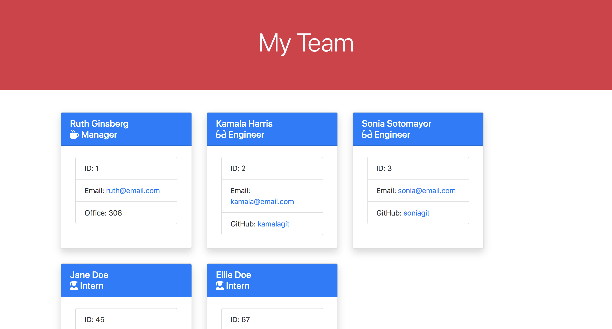

# team-profile-generator

This is a team profile generator that takes user input and returns an html file with pertinent data.

## The Code

This is a Node.js program run from the command line. By utilizing the <a href="https://www.npmjs.com/package/inquirer">Inquirer npm</a> the user answers a series of questions which are used to generate the html file.

The html was generated utilizing the fs.writeFile method and template literals. There is no custom css, all styling is accomplished by linking the <a href="https://getbootstrap.com/">Bootstrap</a> css framework.

## Use

Initiate the app in Node.js using the command line by typing: node index.js

Here is a video showing that the tests passed (utilizing the <a href="https://www.npmjs.com/package/jest">Jest npm</a>) and how to use the application:

<a href="https://drive.google.com/file/d/1z8V1yTPeqmVBXH1sQ8fkIIlwKssJIHAN/view">Video Link</a>

## Tests

Unit tests were run with <a href="https://www.npmjs.com/package/jest">Jest</a>.